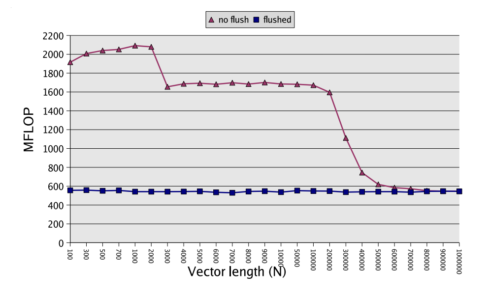
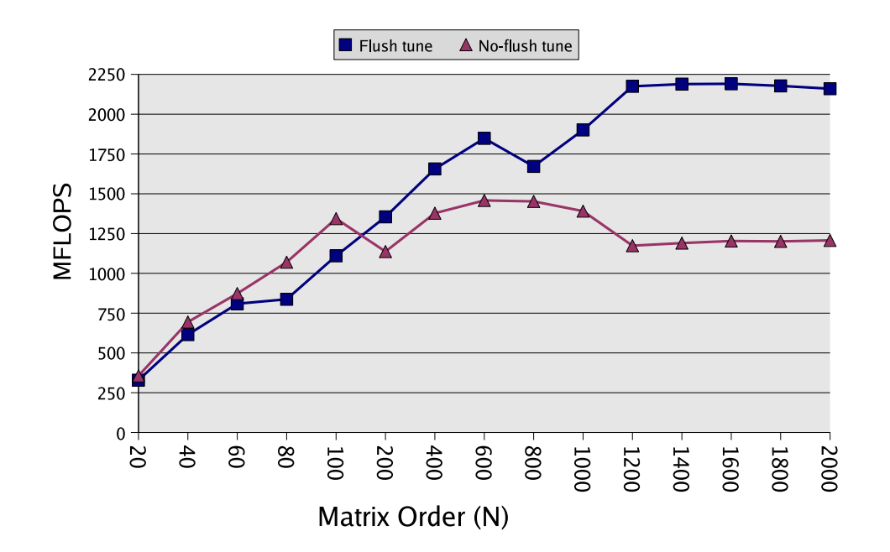

# 在代码优化中做准确的、上下文敏感的计时 #
### 序言 ###
- 性能优化需要在具体问题上反复迭代调优，而优化是否有效，又有赖于能否准确的计时。知道怎样构建可靠的、上下文敏感的计时器是个很容易被忽略的问题，结果是很多独立测试中的优化数据无法在生产环境中重现。本文整理自ATLAS作者RC Whaley在2008年写就的文章 "[Achieving accurate and context‐sensitive timing for code optimization](http://citeseerx.ist.psu.edu/viewdoc/download?doi=10.1.1.113.2520&rep=rep1&type=pdf)"，稍作延伸
### 介绍 ###
- 一般来讲，优化工作的流程是 
    1. 从生产环境剥离热点代码
    2. 编写Benchmark
    3. Benchmark驱动地代码调优
- 针对热点代码(函数)在生产环境中用法的不同，优化要点也可能不同。比如，如果某参数指向的内存由前面的代码输出，且尺寸不大、几乎总是在Cache中，那么在热点代码中进行预读和软流水优化，不但无效，反而可能因为占用额外的发射槽和寄存器压力，损害性能。这类参数常驻Cache的函数的优化要点，在于怎样更好的利用CPU的计算资源，而不是访存；另一方面，如果热点代码操作的数据尺寸够大，或者典型场景下要访问的数据主要在内存中，那么花大力气在计算上做优化会收效甚微，因为代码的瓶颈在访存延迟或总线带宽上。
- 代码优化不只和算法本身有关，也和函数的使用方式有关；哪怕要访问的数据很小，如果典型场景下这部分数据总是在内存中的，那这都可能是一个Memory Bound、而非Compute Bound的算法。典型地，在深度学习当中，每一个Layer的Input数据更可能在Cache中，而Output/Bias/Weight/Act数据往往在主存中，这就为Layer的优化重心提供了建议。
- RC Whaley 在文中举了几个例子：
    1. 根据每轮计时后要不要Flush Cache，dot函数有非常不同的性能表现：
       
       可以看到，如果不Flush Cache的话，根据测试数据的尺寸不同，它可能会常驻L1/L2 Cache，使得性能数值偏高。如果生产环境中dot的参数不具备这种时间局部性，那你更可能看到的是Cache Flushed版本的dot性能，而不是快3倍的那组结果。
    2. 另一个例子是矩阵乘法的性能：
       
       Flush Tuned版本的GEMM实现是在Cache Flushed环境下调优出来的，此时测试的输入矩阵在主存而不是Cache中，ATLAS 的自动优化框架选择了合适的Blocking因子去匹配L1/L2 Cache的大小，使得访存性能最大化；而No-Flush Tuned版本的矩阵乘法实现，由于测试的输入数据常驻某级Cache，对Blocking因子不敏感，将这样调优出来的算法放在不具备时间局部性的场合下使用，会看到随着数据尺寸的增加，性能骤降，尽管矩阵乘法本身其实有很高的计算密度/时间局部性。
- 本文要讨论几种技术，下面是它们的简称：
    - MultTimingSamples：综合多次计时减少误差
    - OneCallFlushLRU：对单次调用计时的Cache Flushing方法
    - OneCallFlushx86：x86专用版本
    - MultCallFlushLRU：对多次调用计时的Cache Flushing方法
    - RangeGuard：避免数值溢出
    - Page0Guard：避免零初始化内存
    - InsLdGuard：避免冷启动
    - MemAlign：内存对齐
### CPU Timer 还是 Wall Timer ###
- Wall Timer：一般系统会提供函数查询当前时间(如系统/进程启动以来的时间或硬件计数器)，在函数执行前后分别计时做差，得到的就是耗时。优点是精度高，缺点是将系统调用和线程被中断后挂起的时间也算进去了。
- CPU Timer：基于线程调度的时间片，来衡量当前用户线程实际执行的时间。优点是受系统总负载影响更小，缺点是精度低。
- 比较Wall Timer和CPU Timer可以看到，如果被计时的函数有系统调用，比如IO或者多线程调度，那么用Wall Timer更好，因为它衡量了被测函数的系统调度效率；如果没有系统调用，那么如果测试环境的机器负载很高或者未知，用CPU Timer能得到更可靠的结果，否则用Wall Timer能得到跟高的精度。
    - ATLAS 本身是自动调优框架，其性能高度依赖计时的精确性，多线程模式下它用的是Wall Timer；单线程模式下默认是CPU Timer(假设负载未知)，同时允许用户传递参数使用Wall Timer
- MultTimingSamples：通过多次计时然后综合结果可以得到更可靠的数据。因为Wall Timer的误差主要来自线程调度，即被测线程被挂起的时间，所以使用Wall Timer多次计时的然后取最小值，就是更精确的结果。用CPU Timer多次计时，由于时间片的精度误差，测得的耗时可能明显偏大/偏小，所以经验上直接取中位数(Median)更有效。
- `int -> float`转换误差：在很多场合下float比int表示的耗时更好用，如果将int的耗时保存在float32中的话，因为float32只有23位尾数，变化最快的低位会被丢弃，故使用有52位尾数的float64更合适
###  单次调用的Cache Flushing计时法 ####
- 如果有Cycle级的计时器或者被测函数本身耗时较长，那么对单次调用计时可能已经能得到可靠的结果。这里介绍下单次调用的Cache Flushing计时。
- OneCallFlushLRU：以下代码是能被应用到大部分系统上的通用方法：
    ```c
        size_t cacheSize = cacheKB * 1024 / sizeof(double);
        double *flush = calloc(cacheSize, sizeof(double));

        float *x = ..., *y = ...;
        for (size_t i = 0; i < N; ++i) {
            x[i] = rand_float();
            y[i] = rand_float();
        }

        double tmp = 0;
        for (size_t i = 0; i < cacheSize; ++i) {
            tmp += flush[i];
        }
        do_not_optimize_away(tmp);

        double t0 = my_time();
        float result = dot(x, y, N);
        do_not_optimize_away(result);
        double t1 = my_time();

        report_duration(t1 - t0);
    ```
    以上代码在初始化测试数据过后，通过访问一段连续内存以期望Cache Conflict/Capacity Miss能换出绝大部分被测函数的参数数据，do_not_optimize_away函数用于输出副作用、避免被测函数被编译器彻底优化掉。值得讨论的是这里用到的cacheKB的大小，如果生产环境典型的是参数数据在主存中，那么很容易认为应该使cacheKB等于最后一级Cache(LLC)的大小；但实践上，由于Cache是基于物理地址而非虚拟地址索引、连续的虚拟地址不保证物理地址连续，Cache的替换策略可能是伪随机而非精确的LRU、多路组相连映射使得单个Cache Line换出时机不定，所以令CacheKB等于某级Cache尺寸往往不能达到我们要的效果。更为有效的做法是，通过递增CacheKB直到观察到被测函数性能不再下降(不能从Cache中得到好处)，采用这里测试得到的CacheKB值。
- OneCallFlushx86：x86因为支持直接Flush某个Cache Line的指令，所以OneCallFlushLRU可以被改写：
    ```c
        float *x = ..., *y = ...;
        for (size_t i = 0; i < N; ++i) {
            x[i] = rand_float();
            y[i] = rand_float();
        }

        for (size_t i = 0; i < N; i += cacheLineSize / sizeof(float)) {
            _mm_clflush(&x[i]);
            _mm_clflush(&y[i]);
        }

        double t0 = my_time();
        float result = dot(x, y, N);
        do_not_optimize_away(result);
        double t1 = my_time();

        report_duration(t1 - t0);
    ```
- OneCallFlushLRU可以做相应的调整以匹配生产环境中的用法，比如减少CacheKB到L1 Cache大小以模拟参数数据通常在L2 Cache而不在L1 Cache中的情况，Flush Cache过后再访问一遍x来模拟x在L1 Cache而y在L2 Cache中的情况；相比之下，由于OneCallFlushx86用到的_mm_clflush会Flush各级Cache，所以没法直接模拟数据在L2 Cache中的情况，但是仍然可以通过再访问一次x来模拟仅x在L1 Cache的场景。
### 多次调用的Cache Flushing计时法 ###
- 当没有Cycle级计时器可用/Cycle级误差仍太大，或系统负载太大需要排除其他任务影响时，我们可能需要对多次调用整体计时。如果直接沿用上面OneCallFlushLRU的做法，会把Flush Cache的时间统计进去，故需要针对多次调用给出专门方案。
- MultCallFlushLRU：调整后的方案如下：
	```c
		size_t cacheSize = cacheKB * 1024 / sizeof(float);
		size_t paramsSize = N + N;
		size_t nSet = (cacheSize + paramsSize - 1) / paramsSize;
		cacheSize = nSet * paramsSize;

		float *X = malloc(sizeof(float) * cacheSize);
		X += cacheSize - paramsSize;
		float *Y = X + N;

		float *x = X, *y = Y;
		for (size_t i = 0; i < nSet; ++i) {
			for (size_t j = 0; j < N; ++j) {
                x[j] = rand_float();
                y[j] = rand_float();
            }
            x -= paramsSize;
            y -= paramsSize;
		}

        double t0 = my_time();

        float alpha = 1;
        float result = 0;
        for (size_t i = 0, j = 0; i < loop; ++i, ++j) {
            if (j == nSet) j = 0;
            if (j == 0) {
                x = X, y = Y;
            } else {
                x -= paramsSize;
                y -= paramsSize;
            }

            result += alpha * dot(x, y, N);
            alpha = -alpha;
        }
        do_not_optimize_away(result);

        double t1 = my_time();

        report_duration((t1 - t0) / loop);
	```
    以上代码在多次调用间使用不同的参数数据，通过预分配的足够大的参数内存，使得再次访问相同参数数据时绝大部分内容已经因为Cache Conflict/Capacity Miss被换出，从而该代码有Self-Flushing效果；alpha变量用于避免浮点溢出异常导致的计时误差。值得注意的是需要按逆序轮询参数内存，避免在执行一个dot的时候，下一块内存已经被CPU预读；鉴于现代CPU Smart Cache预读策略的多样性，以及被测函数的访存不一定总是前向线性，更可靠的轮询参数缓存的方式是随机。
- MultCallFlushLRU稍作更改后也适用于不同参数驻留Cache情况不同的场合，比如为不同参数提供独立的轮询缓冲，如果某参数典型地是常驻L1 Cache的，那测试时不移动该参数对应的指针。
### 计时器的改进  ###
- 锁定CPU频率：服务器和移动CPU出于功耗考虑往往具有变频功能，锁频后计时才能得到可靠的结果
- RangeGuard：部分平台的溢出异常是软件处理的，故如果被测函数内部有溢出的话会导致计时不可靠，所以测试代码和被测函数都应该以类似前文alpha的手段避免溢出。
    - 类似的，部分CPU在处理denormal等特殊浮点数时，也伴随性能惩罚，故也应该通过平台提供的手段关闭这类异常或通过软件手段避免。
- Page0Guard：某些操作系统会延迟分配未初始化的内存页，或将零值页映射到相同的物理页再在写时拷贝，故如果调用计时函数前不初始化参数内存的话，可能导致系统分配页表、初始化页的开销被计时，引入误差。故哪怕被测函数不要求初始化内存(如输出缓冲)，也应该在计时前显示初始化被访问的内存。
- InsLdGuard：在第一次调用被测函数时，其代码所在的页可能还在磁盘、没被映射到物理内存，对应的机器码不在指令Cache，分支预测器等部件也还没缓存被测函数的控制信息，故第一次调用中额外的页缺失、Cache Miss、分支预测失败等开销，可能显著增加计时。所以在实际计时前应该先调用一次被测函数，激活软硬件系统。
    - 运行在Hotspot JVM上的Java等语言，默认是解释执行的，由虚拟机在运行时Profile解释执行的代码，定位瓶颈后再JIT优化。在这样的高级语言虚拟机上的语言中做Dummy调用来激活JIT系统更是必不可少的步骤。
    - 如果被测函数典型地只被调用一次，那么我们这里假设代码常驻指令Cache等假设都不成立，这样的计时反而会引入误差，因为单次调用的函数指令Cache Miss都可能有显著影响、一些通过增加代码尺寸换取性能的常规优化手段都可能起反效果。不过这种情况一般比较少见，因为要优化的函数一般是程序瓶颈，瓶颈代码本身就具有较高的时间局部性。
- MemAlign：内存地址不对齐的读写，在某些CPU上可能意味着额外的Memory Transaction，在Memory Bound的算法中这会显著降低有效带宽、影响性能；一些CPU分别为对齐/不对齐读写提供了专门的SIMD指令，没有对齐到SIMD Lane数的内存读写只能派发到低效的慢路径上。在函数中提供对齐读写的专用代码路径，或者限制输入必须对齐，对改善访存性能大有裨益。
- SMP中的并行计时：在共享内存多处理器中，要注意L1等Cache可能不共享，前文OnCallFlushLRU中的方法只Flush了主线程所在处理器的Cache，故可能需要额外的步骤在计时前Flush各个处理器的Local缓冲。
### 更多讨论 ###
- [《深入理解计算机系统》(CSAPP)](https://book.douban.com/subject/1230413/) 第一版中曾经用第9章整章的篇幅讨论计时
- [How To Write Fast Numerical Code: A Small Introduction](https://users.ece.cmu.edu/~franzf/papers/gttse07.pdf) 一文也用了不小篇幅讨论定位瓶颈、对瓶颈计时
